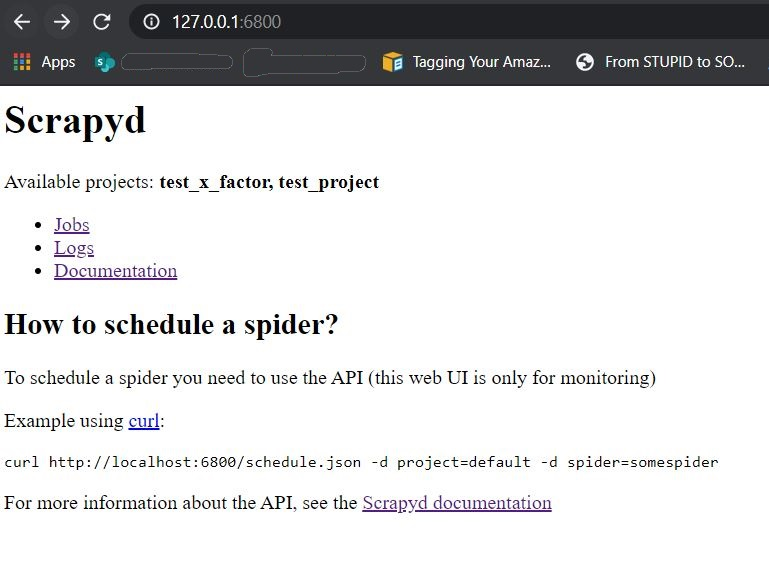

# scrapy-tutorial
A sample python project to showcase web scraping using https://scrapy.org/

This project crawls a simple page on ```https://worldpostalcode.com``` and extracts place name and its respective postal code.

The actual page which is being crawled is, https://worldpostalcode.com/india/madhya-pradesh/jabalpur/

### Running the Spider

The project has a spider named as 'postal_codes' which can be executed using following commands:

```
scrapy crawl postal_codes
```

To store the crawled output to a **JSON/CSV/XML** file ```-o``` option can be used.

```
scrapy crawl postal_codes -o json
scrapy crawl postal_codes -o csv
scrapy crawl postal_codes -o xml
``` 

Actual output files (**items.json & items.csv**) have also been attached for reference. 

### Note

Install ```scrapy``` module on your machine and have a virtual environment to be able to run this code. Follow instructions from https://scrapy.org/

### Extras

Use scrapy shell to quickly crawl something and extract data in real-time. Following command can be used to run scrapy shell.

```
scrapy shell "https://worldpostalcode.com/india/madhya-pradesh/jabalpur/"
``` 

#### Deploying your spiders to Ubuntu using **_scrapyd_**

As explained [here][install-scrapy-ubuntu], scrapy can be installed on Ubuntu by following below steps:

* Install following dependencies:

```
sudo apt-get install python3 python3-dev python3-pip libxml2-dev libxslt1-dev zlib1g-dev libffi-dev libssl-dev
```  
* Create a new virtual environment as stated [here][create-virtual-env]:    

``` 
# create the virtual environment  
python3 -m venv <folder_name>
   
# activate the virtual environment
source tutorial-env/bin/activate
```

* Install scrapy, [scrapyd][scrapyd-installation] & [scrapyd-client][scrapyd-client-git-repo] inside above virtual environment:

```
pip install scrapy

pip install scrapyd

pip install git+https://github.com/scrapy/scrapyd-client.git
```

* Run scrapyd in the background:

```shell script
nohup scrapyd &>/dev/null &
```

* Now scrapyd user interface should be accessible on `http://127.0.0.1:6800`



* As we've installed scrapyd-client, we can use [scrapyd-deploy][scrapyd-deploy] which will create an egg of the given scrapy project and call scrapyd [addversion][scrapyd-add-version] api to upload the project. 
Before we execute `scrapyd-deploy` we have to make following changes to the `scrapy.cfg` file in our scrapy project:
    * Uncomment the line `url = http://localhost:6800/`
    * Add project name just below that: `project = <your_project_name>`
    * Following is the snapshot of `scrapy.cfg` file for reference:
    
        ```
        # Automatically created by: scrapy startproject
        #
        # For more information about the [deploy] section see:
        # https://scrapyd.readthedocs.io/en/latest/deploy.html
        
        [settings]
        default = <your_project_name>.settings
        
        [deploy]
        url = http://localhost:6800/
        project = <your_project_name>
        ```
 
---
[install-scrapy-ubuntu]:https://docs.scrapy.org/en/latest/intro/install.html#ubuntu-14-04-or-above
[create-virtual-env]:https://docs.python.org/3/tutorial/venv.html#creating-virtual-environments
[scrapyd-installation]:https://scrapyd.readthedocs.io/en/stable/install.html
[scrapyd-client-git-repo]:https://github.com/scrapy/scrapyd-client.git
[scrapyd-add-version]:https://scrapyd.readthedocs.io/en/stable/api.html#addversion-json 
[scrapyd-deploy]:https://github.com/scrapy/scrapyd-client#scrapyd-deploy

